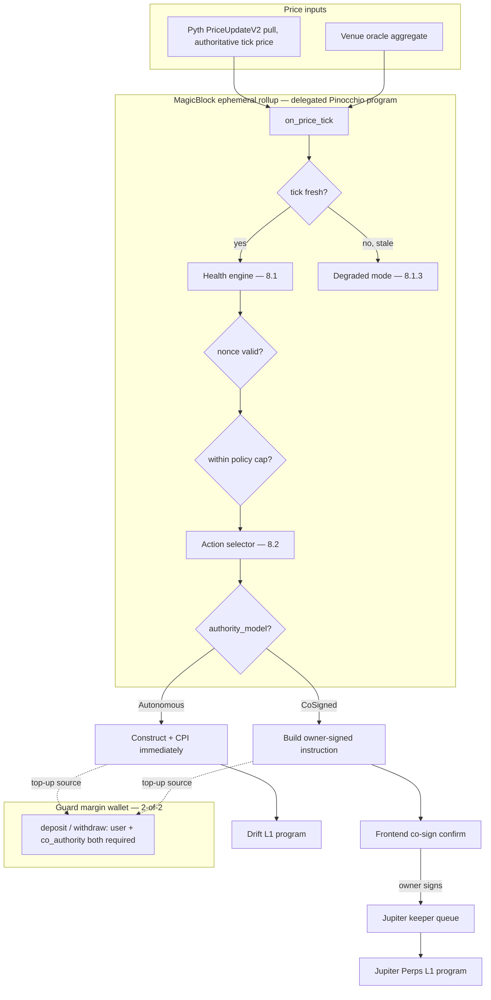
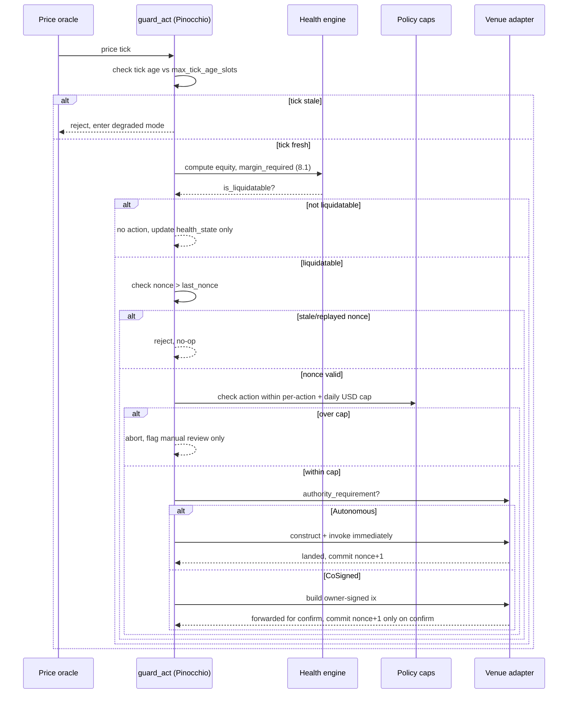

# Wick — Hackathon Execution Addendum

Companion to `quench-guard-architecture.md`. That doc is the product architecture. This is the "how do I actually ship a demo on a clock" layer on top of it. Read the main doc first — this doesn't repeat the technical spec, only adds what it's missing.

---

## 1. Naming — decision

**Wick.** Final. This is a tighter fit than "Quench Guard" was:
- A **wick** is what catches fire and burns down toward the position — it's the industry's own word for the price action right before a liquidation cascade.
- **Quench** (the parent project) is the thing that puts the wick out before it burns through. The two names now form one coherent story instead of one project just being modified by a generic noun ("Guard").
- It's shorter, trader-native, and reads as a real product name rather than a description of a feature.

Every reference to "Quench Guard" below now reads "Wick." "Quench" itself still refers to the parent project/lineage where it comes up — that reference stays as-is.

---

## 2. The single biggest risk in the doc — and its timebox

Section 2's open 🔴 — whether `ephemeral-rollups-sdk` has a Pinocchio-native delegation path, or whether you hand-build CPIs against the raw `delegation-program` — is flagged as "highest-risk" but has **no timebox and no fallback**. Left open, this is the item most likely to eat your entire build window with nothing to show for it.

**Fix: hard 4-hour discovery cap, decided before any guard logic is written.**

- **Hour 0–4, discovery only:** install the official MagicBlock Dev Skill (`npx add-skill https://github.com/magicblock-labs/magicblock-dev-skill`), pull current docs.magicblock.gg delegation flow, and get a *minimal* delegate/commit/undelegate round-trip working against a Pinocchio program on devnet — doesn't need to touch your guard logic yet, just prove the CPI path exists.
- **If it works by hour 4:** proceed.
- **If it doesn't by hour 4, pick any one fallback and stop deciding:**
  - **(a) Thin Anchor delegation shim:** an Anchor program owns only the delegate/commit/undelegate boundary and CPIs into your Pinocchio program for all actual guard logic and state. Pinocchio still owns everything that matters (accounts, math, authority checks); Anchor is just the door.
  - **(b) Off-chain keeper stand-in:** skip on-chain ER delegation for the hackathon. Run the trigger engine as an off-chain bot signed by the guard authority key, hitting the same instructions the on-chain version would call. State clearly in the demo: "ER delegation is the productionized path; this keeper is the demo stand-in, same instruction set either way." Don't let this be discovered live — say it up front.

Whichever you pick, write it down in the repo README the moment you decide. Don't leave the team or the judges guessing which path shipped.

---

## 3. MVP cut — what has to be live vs. what's stretch

**Must be live, on stage, real (not mocked):**
- Phase 1 — Pinocchio guard program, passing tests (account layout, 6A.1 math, authority checks).
- Phase 2 — DriftAdapter, autonomous, one real measured sub-50ms action against the L1 baseline. This is your "beat the liquidator" claim — it needs to be true, not illustrated.

**Stretch — build if time allows, don't block the demo on it:**
- Phase 3 (Jupiter) — if time is short, cut to **safety-net only**: `instant_create_tpsl` set at enrollment. Skip the live co-sign UX and keeper-queue race. Say "safety net is live; active co-sign is designed and partially wired" — a clean partial beats a live co-sign flow that stalls on stage.
- Phase 4 (Pyth Lazer wiring) — check first whether Drift's own price stream is already sufficient for the demo before building a separate Lazer plugin integration. You may not need both.
- Phase 5 (dashboard) — one real, honest latency chart (Drift sub-50ms vs. L1 baseline, actual measured samples) beats five polished-but-static panels. Build that one chart first; everything else in the dashboard is optional polish.
- Phase 7 (frontend) — `/` is the brand landing (Ember Circuit, serif display, gradient hero, latency proof numbers from the measured sample set); `/console` is the two-column console (left rail: authority/venue/guard policy; right column: live guard, health, stats, latency, activity). The console reads the deployed guard account via `useGuardAccount` and falls back to honest fixtures when devnet has no account.

---

## 4. Demo narrative — lead with this, don't bury it

Open with the finding, not the architecture:

> "We went looking for a way to auto-protect Jupiter Perps positions and found something most teams miss: Jupiter's CPI client requires the position owner to sign every single state change — there's no delegated authority, verified straight from the account flags in the IDL-generated client source. A fully autonomous guard on Jupiter isn't a latency problem, it's architecturally impossible. So instead of faking it, we built two honest speed tiers — a truly autonomous sub-50ms guard on Drift (signed as the position delegate), and a co-signed safety net on Jupiter that never claims to be faster than it is."

Then show the sub-50ms Drift action landing against the measured L1 baseline. That's your proof. Everything else supports it.

---

## 5. Environment checklist — do this before Phase 1 code

- Pin Solana CLI / toolchain version.
- Confirm you're pointed at the correct MagicBlock ER devnet RPC endpoint, not plain devnet — check this before writing any delegation code.
- Confirm current Pinocchio crate version on crates.io/GitHub at build time (don't trust a remembered version).
- Confirm `jup-perps-client` v1.2.0 is still current on crates.io.
- Confirm Drift `User.delegate` semantics on the target deployment before the build starts, not discovered mid-build.

---

## 6. Risk register (consolidated)

| Risk | Likelihood | Impact if unaddressed | Action | Timebox |
|---|---|---|---|---|
| ER delegation path unclear for Pinocchio (Section 2 🔴) | High | Blocks Phase 1+ entirely | Discovery sprint → shim or keeper fallback | 4 hrs, hard stop |
| Jupiter co-sign UX not finished in time | Medium | Weak/broken live demo segment | Cut to TP/SL-only safety net, say so explicitly | Decide by mid-build checkpoint |
| Drift `User.delegate` semantics not confirmed early | Low-Medium | Build time wasted on setup | Confirm delegate semantics before Phase 1 starts | Day 0 |
| Dashboard scope creep | Medium | Time spent on polish instead of the one chart that matters | Build the honest latency chart first, everything else optional | Ongoing |
| Team improvises which fallback was taken | Low | Confused/inconsistent demo narrative | Document decision in README the moment it's made | Immediate |

---

## 7. Full architecture diagram

The inline diagram shown in chat covers the overview. This is the same flow with the pieces the overview compresses out — the guard margin wallet, the nonce/cap gate, and the actual dispatch branch — kept as a `mermaid` block so it stays readable in GitHub/any markdown viewer without needing the chat UI.

### 7.1 Component + data flow



### 7.2 Critical-path sequence — what actually has to happen in order

This is the part that's easy to get wrong: the order of checks inside `guard_act` matters. Skip the staleness check and you act on dead data. Skip the nonce check and a replayed or forked-ER tick double-executes. Skip the cap check and a single bad tick can drain the margin wallet.



---

## 8. Core algorithms — full specification

### 8.1 Fixed-point health engine (complete)

```rust
const SCALE: i128 = 1_000_000;      // matches 6-decimal price exponent — CONFIRM venue's actual exponent at integration
const BPS_DENOM: i128 = 10_000;
const MAX_TICK_AGE_SLOTS: u64 = 25; // ~10s at ~400ms/slot — starting point only, tune per venue

fn compute_pnl(size: i128, entry: i128, current: i128) -> Result<i128, GuardError> {
    // size is signed: positive = long, negative = short. No special-casing needed.
    let price_delta = current.checked_sub(entry).ok_or(GuardError::MathOverflow)?;
    let raw = size.checked_mul(price_delta).ok_or(GuardError::MathOverflow)?; // scaled by SCALE^2
    raw.checked_div(SCALE).ok_or(GuardError::MathOverflow)
}

// The basis is *notional*, not the raw unit count. Taking bps of a unit count
// yields units, which is then compared against equity in USD — a dimensional
// mismatch that makes the requirement price-independent and collapses it by a
// factor of `current`, so the guard only fires at outright insolvency.
fn compute_margin_required(abs_size: i128, margin_bps: i128, current: i128) -> Result<i128, GuardError> {
    let notional = abs_size.checked_mul(current)
        .and_then(|v| v.checked_div(SCALE))
        .ok_or(GuardError::MathOverflow)?;
    notional.checked_mul(margin_bps)
        .and_then(|v| v.checked_div(BPS_DENOM))
        .ok_or(GuardError::MathOverflow)
}

fn is_liquidatable(collateral, size, entry, current, margin_bps) -> Result<bool, GuardError> {
    let pnl = compute_pnl(size, entry, current)?;
    let equity = collateral.checked_add(pnl).ok_or(GuardError::MathOverflow)?;
    let margin_required = compute_margin_required(size.abs(), margin_bps, current)?;
    Ok(equity < margin_required) // cross-multiplied — never equity/margin_required, never a float
}
```

#### 8.1.3 Stale-tick rejection + degraded mode (the 🔴 item the main doc flags but doesn't spec)

```rust
fn accept_tick(current_slot: u64, last_check_slot: u64) -> bool {
    current_slot.saturating_sub(last_check_slot) <= MAX_TICK_AGE_SLOTS
}
```

The easy-to-miss part: a rejected tick can't just mean "do nothing this tick." If ticks keep failing freshness for several consecutive checks, the guard is now silently protecting against stale prices — worse than no protection, because the dashboard still shows it as active. On N consecutive stale ticks (policy-configurable, start with N=3):
1. Flip the guard state to `degraded`, surfaced to the frontend immediately (not just logged).
2. For the Autonomous venue only, fall back to a direct read of the venue's own oracle account instead of the cached ER tick — bypass the cache.
3. For CoSigned venues, degraded mode does nothing extra — the pre-signed TP/SL floor from enrollment is the fallback, which is exactly why that floor exists.

### 8.2 Action selection — full precedence with cap enforcement

```rust
fn select_action(
    health: &HealthSnapshot, policy: &VenuePolicy, nonce: u64, last_nonce: u64,
    daily_spent_usd: u128,
) -> Result<Option<Action>, GuardError> {
    if nonce <= last_nonce {
        return Ok(None); // stale or replayed — hard reject
    }

    // 1. TP first if the price has crossed it — realizing a planned exit
    //    is preferable to a defensive top-up or close. Crossing direction
    //    follows the sign of `size`: a long takes profit above its target,
    //    a short below it. `size == 0` never fires.
    if let Some(tp) = policy.take_profit {
        if tp.crossed(health.current_price, health.size.signum()) {
            return Ok(Some(Action::TakeProfit))
        }
    }

    if !is_liquidatable(health.collateral, health.size, health.entry, health.current_price, policy.maintenance_bps)? {
        return Ok(None);
    }

    // 2. Top-up if it's enough to clear the breach on its own and within cap.
    //    Target the trigger buffer, not bare maintenance: restoring equity to
    //    exactly `req` lands it *on* the liquidation line, so the next adverse
    //    tick re-breaches and burns another top-up against the daily cap. This
    //    is the same target the partial-close solver uses (§8.3).
    let req = compute_margin_required(health.size.abs(), policy.maintenance_bps, health.current_price)?;
    let target = req.checked_mul(BPS_DENOM + policy.trigger_buffer_bps)?.checked_div(BPS_DENOM)?;
    let equity = health.collateral.checked_add(compute_pnl(health.size, health.entry, health.current_price)?)?;
    let topup_needed = target.checked_sub(equity)?;
    if topup_needed > 0
        && policy.action_caps.within_cap(ActionType::TopUp, topup_needed)
        && policy.action_caps.within_daily(daily_spent_usd, topup_needed) {
        return Ok(Some(Action::TopUp(topup_needed)))
    }

    // 3. Partial close — see 8.4 solver. Only reached where top-up alone
    //    can't clear the breach within cap.
    let f_bps = solve_partial_close_fraction(
        health.collateral, health.size, health.entry, health.current_price,
        policy.maintenance_bps, policy.trigger_buffer_bps, policy.feebps,
    )?;
    // The cap is denominated in USD, so it must be applied to the USD notional
    // actually closed. `f_bps` is a fraction in [0, BPS_DENOM]; comparing it
    // against a USD ceiling passes for every possible value, which makes the
    // cap inert and step 4 below unreachable via this branch.
    let notional = health.size.abs().checked_mul(health.current_price)?.checked_div(SCALE)?;
    let closed_usd = notional.checked_mul(f_bps)?.checked_div(BPS_DENOM)?;
    if policy.action_caps.within_cap(ActionType::PartialClose, closed_usd)
        && policy.action_caps.within_daily(daily_spent_usd, closed_usd) {
        return Ok(Some(Action::PartialClose(f_bps)))
    }

    // 4. Nothing fits inside caps — do not silently do nothing. Escalate.
    Ok(Some(Action::EscalateManualReview))
}
```

Three things in that listing were wrong in earlier revisions of this spec, and the program inherited all three — they are called out inline above because the wrong version reads as perfectly reasonable:

- **The partial-close cap compared `f_bps` against a USD ceiling.** `f_bps` maxes out at `10_000`; the configured ceiling is `5_000 * SCALE`. Every value passed, so the cap never bound and step 4 was unreachable from step 3 — a guard that should have escalated executed an unbounded close instead.
- **Top-up targeted bare `req`.** That is the liquidation line itself, not a safe distance from it.
- **`daily_total_usd` had no accumulator**, so it was a second per-action ceiling rather than a daily one, and N successive within-cap top-ups could drain the margin wallet across N ticks. `within_daily` takes the running `daily_spent_usd` and the guard account carries it (`daily_spent_usd: u128` + `daily_epoch_start_slot: u64`, reset on rollover).

The common shape: a cap that is present in the code, reads as enforced on the dashboard, and does nothing. Prefer checks whose units are visible at the comparison site.

The last branch matters: a guard that just no-ops when every option is over-cap looks, from the outside, identical to a guard that checked and decided the position was fine. Those are not the same state — surface the difference.

### 8.3 Partial-close solver (the part the main doc deferred)

A closed-form solve is genuinely fragile — the algebra has a fee-dependent sign flip, and getting that wrong in fixed-point integer math is a real bug class. **Use a bounded binary search instead of a closed form.** It's monotonic in well-behaved regimes, avoids sign-case algebra, and costs at most 20 iterations.

```rust
fn solve_partial_close_fraction(
    collateral, size, entry, current, maintenance_bps, buffer_bps, fee_bps,
) -> Result<i128, GuardError> {
    // Returns f_bps in [0, 10_000] — fraction of size to close.
    let abs_size = size.abs();
    let pnl = compute_pnl(size, entry, current)?;
    let m_full = compute_margin_required(abs_size, maintenance_bps, current)?;
    let target_full = m_full.checked_mul(BPS_DENOM + buffer_bps)?.checked_div(BPS_DENOM)?;
    let notional = abs_size.checked_mul(current)?.checked_div(SCALE)?;
    let fee_full = notional.checked_mul(fee_bps)?.checked_div(BPS_DENOM)?;

    let is_safe = |f_bps| -> Result<bool, GuardError> {
        let rem = BPS_DENOM - f_bps;
        let fee = fee_full.checked_mul(f_bps)?.checked_div(BPS_DENOM)?;
        let rc = collateral.checked_sub(fee)?;
        let rp = pnl.checked_mul(rem)?.checked_div(BPS_DENOM)?;
        let rt = target_full.checked_mul(rem)?.checked_div(BPS_DENOM)?;
        Ok(rc.checked_add(rp)? >= rt)
    };

    if !is_safe(BPS_DENOM)? {
        // Closing 100% still doesn't reach target — fees/price outran collateral.
        return Err(GuardError::CannotReachSafeBuffer);
    }

    let (mut lo, mut hi) = (0i128, BPS_DENOM);
    for _ in 0..20 {
        let mid = (lo + hi) / 2;
        if is_safe(mid)? { hi = mid; } else { lo = mid + 1; }
    }
    Ok(hi) // minimal fraction to reach the buffer
}
```

Before trusting this against a real venue: hand-compute the math on a sample set covering long-near-breach, short-near-breach, and fees-large-relative-to-move, plus a case that hits `CannotReachSafeBuffer`. If monotonicity breaks — closing *more* makes health *worse* — escalate rather than patch.

### 8.4 Two-regime authority dispatch

```rust
fn guard_act(guard: &mut PositionGuard, action, venue, &dyn VenueAdapter) -> Result<(), GuardError> {
    let expected_nonce = guard.nonce.checked_add(1).ok_or(GuardError::MathOverflow)?;

    match venue.authority_requirement() {
        Autonomous => { venue.execute(&action)?; guard.nonce = expected_nonce; guard.last_action = Some(action) }
        CoSigned => {
            let ix = venue.build_owner_signed_ix(&action)?;
            guard.pending_confirm = Some((ix, expected_nonce)); // nonce not committed yet
            // nonce commits only when the owner confirms on L1
        }
    }
}
```

The trap: if nonce advances the moment the CoSigned instruction is *built* rather than when the owner *confirms*, a second genuine breach arriving while the user is reading gets treated as a replay and silently dropped.

### 8.5 Co-authority withdraw — 2-of-2 check

```rust
fn validate_withdraw(user, guard_pda, wallet) -> Result<(), GuardError> {
    if !user.is_signer || user.key != wallet.owner { return Err(MissingOwnerSignature); }
    if !guard_pda.is_signer || guard_pda.key != wallet.co_authority { return Err(MissingCoAuthority); }
    // Both required — test the matrix explicitly: user-only fails, co-authority-only
    // fails, wrong-pubkey-with-signer-flag-set fails, both-correct succeeds.
}
```

### 8.6 Delegation CPI — shape only, not signatures

Still open 🔴. Illustrative of the account shape you're proving out in the hour 0–4 window:

```text
delegate(ctx):
    accounts needed (verify names/order vs ephemeral-rollups-sdk):
      - delegated_account, buffer_account, delegation_record, owning_program, payer, system_program
    -> CPI into DELeGGvXpWV2fqJUhqcF5ZSYMS4JTLjteaAMARRSaeSh (verified program ID, Section 2)
```

### 8.7 Venue adapters — Drift (autonomous) and Jupiter (co-signed)

The guard's venue adapters are the only code path that constructs a
venue-side CPI. Every adapter re-derives its accounts from the tail of the
`OnPriceTick` account list and serializes **its own** instruction bytes, so
the exact wire format is pinned in one place and covered by byte-level unit
tests (no foreign serialize produced at runtime).

#### 8.7.1 Drift / Velocity (autonomous tier, hard reduce-only)

Drift perps are the autonomous tier. The live program is **Velocity**
(`velocity-exchange/protocol-v2`) — the successor to the decommissioned Drift
v2 deployment, same ABI, new program ID. `drift.rs` encodes `place_perp_order`
from that source:

```text
data = 8-byte discr + 34-byte OrderParams (borsh, optionals None):
  [8]  order_type              = Market             (ORDER_TYPE_MARKET=0)
  [9]  market_type             = Perp              (MARKET_TYPE_PERP=1)
  [10] direction               = Long(0)/Short(1)  (reduces vs. guarded side)
  [11] user_order_id           = 0
  [12..20] base_asset_amount   (u64 LE)
  [20..28] price               (u64 LE)
  [28..30] market_index        (u16 LE)   ← pinned in guard state at init
  [30] reduce_only = true                ← hard-coded in the serializer
  [31..40] post_only / notifications    (== None/0)
  [40..42] builder_idx / builder_fee_tenth_bps (Option: None)
accounts: state(ro) → user(w, crate::processor) → authority(Signer) → [remaining…]
```

- **Program ID:** `vELoC1audYbSYVRXn1vPaV8Axoa9oU6BYmNGZZBDZ1P` (live
  Velocity `declare_id!`; the decommissioned `dRifty...` id is retired). The
  e2e proof (`real_drift.rs`) loads the real velocity BPF ELF, not a mock,
  and runs the reduce against real mainnet account fixtures.
- **Account order** (verified from source): `state` (`Box<Account<State>>`,
  readonly) → `user` (`AccountLoader<User>`, writable, PDA
  `["user", authority, sub_account_id.to_le_bytes()]`) → `authority`
  (`Signer`, signer+readonly in metas) → remaining perp accounts (market,
  oracle, perp/spot maps…) appended in SDK order.
- **Jupiter (co-signed tier)** is the counterpart adapter: `jupiter.rs` builds
  the owner-signed `instant_create_tpsl` safety net and the guard persists it as
  `pending_ix`, never signing or submitting it (§8.4 CoSigned).
- **Delegation model** (verified from `available via can_sign_for_user` in
  `instructions/constraints.rs`): the venue owner sets the **guard PDA as
  `User.delegate`** off-chain; the guard PDA signs as `authority`. Velocity
  guarantees delegates **cannot withdraw funds**, but does **not** scope
  order placement — the hard reduce-only edit is what prevents
  sticky/full-position orders. The mock Drift in `mocks/drift/` models this
  invariant faithfully: it reads `User.delegate` out of the user account and
  rejects the CPI unless `authority.address() == delegate` **and**
  `authority.is_signer()` — the autonomous e2e test fails if either holds
  against the guard PDA.
- **Market + sub-account pinning:** `market_index` and `drift_subaccount_id`
  are recorded in guard state at `InitGuard` (fields `drift_market_index` /
  `drift_subaccount_id`, appended to the 342-byte wire layout); the reduce
  path uses the pinned market, never a tick-supplied value. The operator
  derives the user PDA from the pinned sub-account id.
- **Execution** (`execute_drift_autonomous`): Long position (`size ≥ 0`)
  reduces with `PositionDirection::Short`; short reduces with `Long`.
  `base_asset_amount = |watched size| × fraction_bps / 10_000` (10_000 for a
  full take-profit close); a zero-size reduce escalates rather than idle.
  `price` = the guard's current breach/take-profit price. CPI is signed as
  the guard PDA (the `delegate`) via `seeds!("guard", venue_owner, bump)`.
- **InvalidInstruction on missing accounts** — the adapter/handlers reject
  a tick that omits the required state/user/authority slice
  (`accounts.get(2..)`), so a malformed tick cannot silently skip the reduce.